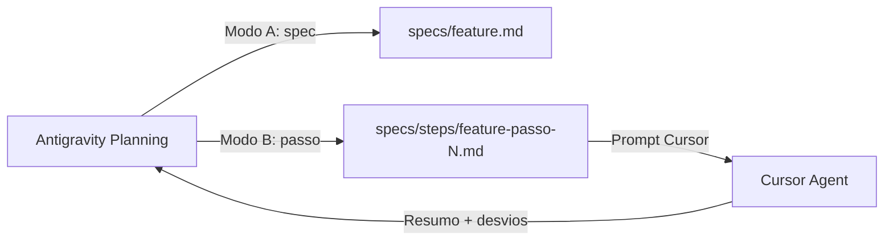

# Antigravity — pack Gemini (specs e handoff)

Configuração para o **Google Antigravity** (modo Planning): specs, ADRs e passos de implementação. A **codificação** fica no **Cursor Agent** — ver [GEMINI.md](./GEMINI.md).

## Arquivos nesta pasta

| Arquivo | Uso |
|---------|-----|
| [GEMINI.md](./GEMINI.md) | Instruções principais (Modo A: spec · Modo B: passo) |
| [AGENTS.md](./AGENTS.md) | Guardrails cross-tool (segurança, divisão Antigravity ↔ Cursor) |
| [agent-rules/spec-authoring.md](./agent-rules/spec-authoring.md) | Checklist modular para specs |
| [templates/step-handoff.template.md](./templates/step-handoff.template.md) | Template de `specs/steps/<feature>-passo-N.md` |

## Instalação

### Opção A — Por repositório (recomendado neste monorepo)

A pasta `.cursor/antigravity/` já está versionada. No Antigravity, cite:

```
@./.cursor/antigravity/GEMINI.md
```

Não é necessário copiar para `~/.gemini/` se o projeto tiver `.cursor/antigravity/`.

### Opção B — Global (`~/.gemini/`)

Para usar o mesmo pack em **qualquer** repo sem `.cursor/antigravity/`:

```bash
# Na raiz do scafolding (fonte canônica)
./scripts/sync-cursor-config.sh --gemini --force

# Ou junto com o sync do Cursor
./cursor-config/install.sh --force --gemini
```

Isso copia `GEMINI.md` e `AGENTS.md` para `~/.gemini/`.

### Precedência

| Local | Efeito |
|-------|--------|
| `GEMINI.md` ou `AGENTS.md` na **raiz do repo** | Sobrescreve `~/.gemini/` |
| `~/.gemini/` | Default global no Antigravity |
| `@./.cursor/antigravity/` | Override fino por projeto (sem duplicar na raiz) |

Com instalação global ativa, **não** mantenha cópias na raiz do repo — use `@./.cursor/antigravity/` para ajustes pontuais.

## Workflow resumido



| Ferramenta | Papel | Modo |
|------------|-------|------|
| Antigravity + GEMINI.md | Spec, ADR, passos | Planning |
| Cursor + `.cursor/rules` | Código, testes | Agent / Composer 2.5 |
| Tab / Ask | Ajustes pontuais | Inline |

## Sincronização com o pack Cursor

O `scripts/sync-cursor-config.sh` já copia `.cursor/antigravity/` junto com o restante de `.cursor/` (global ou para outro repo). A flag `--gemini` adicional instala só em `~/.gemini/`.

Documentação relacionada:

- [../README.md](../README.md) — índice do pack Cursor
- [../GLOBAL-SETUP.md](../GLOBAL-SETUP.md) — `~/.cursor` global
- [../../cursor-config/README.md](../../cursor-config/README.md) — onboarding do time
- [../../specs/steps/README.md](../../specs/steps/README.md) — convenção de nomes dos passos
