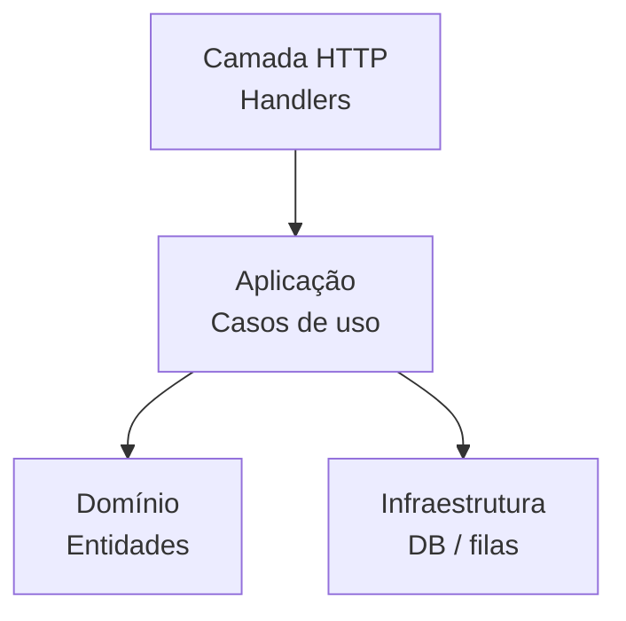
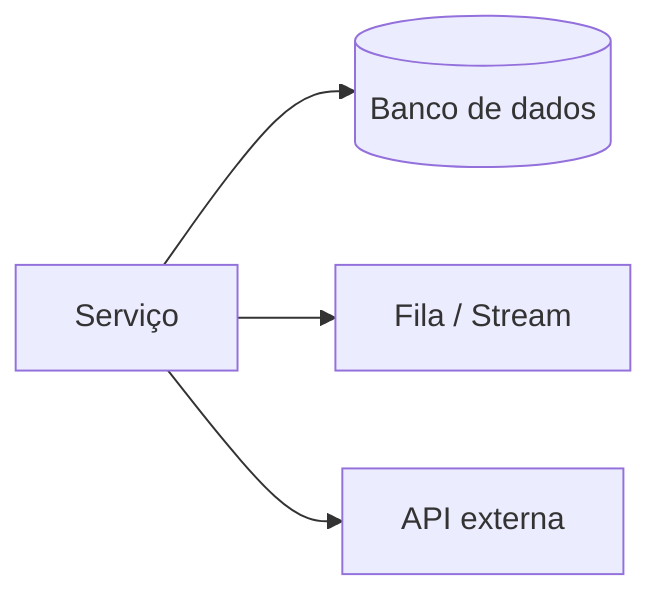
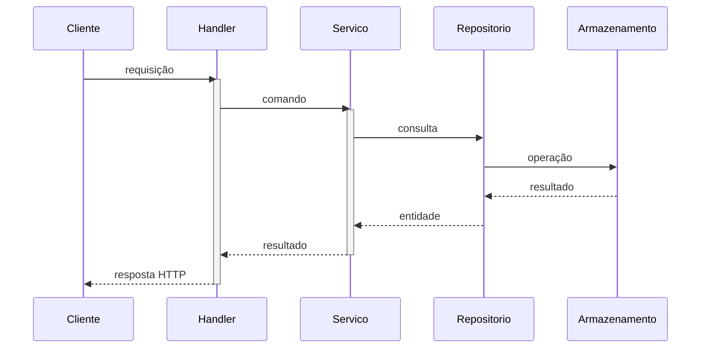

**Alvo:** caminho no repositório (`.` = raiz do workspace) — combinar com o usuário se o workspace for monorepo.

**Saída:** na **raiz do repositório alvo**, criar ou substituir:

1. `{NOME_PROJETO}.md` — referência rápida (snapshot, arquitetura, rotas, dados, operação, riscos).
2. `{NOME_PROJETO}-issues.md` — decisão de sprint (tabela-mestre com score, roadmap, top 10 com antes/depois).

**Papel:** revisão técnica focada em **ROI**, no estilo **staff engineer**. Métricas e scores devem ser **quantitativos quando houver dado**; quando for estimativa, marcar explicitamente como `[estimativa]` ou `[hipótese]`.

**Regra de ouro:** quem lê o arquivo 1 entende o grosso em **30 s**; quem lê o arquivo 2 consegue **decidir o sprint em 60 s**.

**Somente leitura de código:** não editar arquivos de produção neste fluxo — apenas os dois Markdown.

- Segurança detalhada (OWASP, diff): [`security-review`](./security-review.md) — não duplicar checklist SEG aqui.
- Erros/logs: [errors-and-logging](../rules/errors-and-logging/rule.mdc). Camadas: [architecture](../rules/architecture/rule.mdc).

**Objetivo:** dois `.md` na raiz (referência + issues com ROI). **Done when:** arquivos gerados e resumo no chat.

**Quando usar:** assumir/auditar um projeto; planejar sprint com base em débito técnico; snapshot para stakeholders.

**Não usar quando:** doc técnica de um módulo → [`create-doc`](./create-doc.md); só segurança → [`security-review`](./security-review.md); README de onboarding → [`readme`](./readme.md).

> **⚠️ Revisão humana obrigatória antes de commitar os arquivos gerados.**
> Produzidos por LLM com base na leitura do código — podem conter imprecisões, estimativas incorretas ou informações desatualizadas. Não commitar sem revisar, especialmente: scores de impacto, paths referenciados e a seção de riscos. Verificar que nenhuma informação sensível (credenciais, nomes de clientes, dados de produção) foi incluída.

---

## Dimensões de análise

Todas as issues encontradas nos Passos 2–3 devem ser classificadas em uma destas quatro dimensões. As siglas aparecem na coluna `Dim` da tabela-mestre.

| Sigla | Dimensão | O que cobre |
|---|---|---|
| **COD** | Código | Qualidade, correção, SOLID, duplicação, complexidade, testes |
| **PERF** | Performance / Cardinalidade | Latência, N+1, queries sem LIMIT, labels de métrica com alta cardinalidade |
| **TEL** | Telemetria | Logs, métricas, traces, alertas, observabilidade operacional |
| **SEG** | Segurança e Dados | Secrets, PII, autenticação, validação, CVEs, retenção de dados |

---

## Escala de scoring

Cada issue recebe um score calculado como: **`(Imp × Prob × Alc) ÷ Esf`**

| Fator | Sigla | Escala | Critério |
|---|---|---|---|
| Impacto | Imp | 1–5 | 1 = cosmético · 3 = degradação perceptível · 5 = perda de dados ou indisponibilidade |
| Probabilidade | Prob | 1–5 | 1 = hipotético · 3 = ocorre sob carga ou caso específico · 5 = já ocorreu ou ocorre em produção |
| Alcance | Alc | 1–5 | 1 = um endpoint/função · 3 = um módulo · 5 = sistema inteiro ou integrações externas |
| Esforço | Esf | 1–5 | 1 = linha única · 3 = algumas horas · 5 = dias ou refactor de camada |

**Score máximo teórico:** 5 × 5 × 5 ÷ 1 = 125. **Faixas do roadmap:** Sprint 1 → score > 25 · Sprint 2 → 10–25 · Sprint 3 → < 10.

Quando não houver dado suficiente para atribuir um valor com confiança, usar o valor mais conservador e marcar com `[estimativa]`.

---

## Passo 1 — Identificar o projeto

### 1.1 Nome e runtime

Detectar `NOME_PROJETO` pelo manifesto na raiz do alvo:

| Arquivo | Stack | Como extrair o nome |
|---|---|---|
| `package.json` | Node.js | campo `"name"` |
| `go.mod` | Go | último segmento do path do `module` |
| `pom.xml` | Java/Kotlin | `<artifactId>` |
| `build.gradle` / `build.gradle.kts` | Java/Kotlin | `rootProject.name` |
| `pyproject.toml` / `setup.py` | Python | campo `name` |
| `Cargo.toml` | Rust | `[package].name` |

Se nenhum manifesto bater: usar o nome da pasta raiz do alvo.

### 1.2 Tipo de repositório

Classificar antes de continuar — o tipo determina quais seções do arquivo de referência se aplicam:

| Tipo | Indicadores |
|---|---|
| **API HTTP** | controllers com rotas, `@RestController`, `router.get/post`, `urlpatterns` |
| **Worker / Job** | ausência de HTTP listener, loop de consumo (`consumer.poll`, `for msg := range`, `cron`) |
| **CLI** | `cmd/`, `bin/`, `commander`, `cobra`, `click`, `argparse` |
| **Biblioteca** | ausência de server/listener, exports de funções/classes públicas, `index.ts`, `lib/` |
| **Híbrido** | combinação dos acima |

### 1.3 Stack de observabilidade

Registrar o que aparecer nas dependências:

- Go: OTel SDK, DataDog statsd/agent, NewRelic, cliente Prometheus
- Java: Micrometer, Spring Actuator, OpenTelemetry
- Node.js: `prom-client`, `dd-trace`, `@opentelemetry/sdk-node`
- Python: `prometheus_client`, `ddtrace`, `opentelemetry-sdk`

Se nenhum for encontrado: registrar como gap de TEL antes de continuar.

**Data do diagnóstico:** registrar em ISO `YYYY-MM-DD`.

---

## Passo 2 — Leitura do código

Ler nesta ordem de prioridade. Declarar no chat o que ficou **fora de escopo por tamanho** (monorepos grandes, gerado automaticamente, vendor/).

1. Manifesto de build e configuração de runtime (`.tool-versions`, `.nvmrc`, `.python-version`, `.env.example`)
2. Entry points: `main.go`, `cmd/`, `src/index.ts`, `app.py`, `Application.java`, `server.ts`
3. Handlers/controllers/rotas
4. Camada de domínio/serviços (`domain/`, `service/`, `use-cases/`)
5. Infraestrutura (`infra/`, `repositories/`, `database/`, `messaging/`)
6. Configuração de observabilidade (`telemetry/`, `metrics/`, `logging/`)
7. Testes (`tests/`, `*_test.go`, `*.spec.*`, `*.test.*`)
8. CI/CD (`.github/workflows/`, `cloudbuild.yaml`, `Dockerfile`)

Para cada arquivo, anotar:

- Padrão arquitetural identificado
- Entidades de domínio, campos, relacionamentos e campos com **PII** (CPF, e-mail, telefone, dados financeiros)
- Rotas ou jobs: métodos, handlers, middlewares, autenticação
- Dependências externas: bancos, filas, APIs, caches — com timeout e retry se configurados
- Instrumentação presente: métricas, logs estruturados, traceId/correlationId
- Problemas encontrados classificados por dimensão (COD / PERF / TEL / SEG)
- TODO/FIXME com débito assumido

---

## Passo 3 — Gerar o arquivo de referência: `{NOME_PROJETO}.md`

Escrever o arquivo completo seguindo exatamente esta estrutura. Toda redação em **português do Brasil**; trechos copiados de código permanecem como no repositório.

```
# Diagnóstico técnico: {NOME_PROJETO}
_Gerado por `/diagnostico` em {DATA_ISO} · Issues: [{NOME_PROJETO}-issues.md](./{NOME_PROJETO}-issues.md)_

---

## § 1 — Snapshot (30 s)

### O que é
{2–3 frases: problema que resolve, quem usa, o que acontece no mundo real quando funciona.
Sem jargão técnico — um não-desenvolvedor deve entender.}

### Como roda

| Atributo | Valor |
|---|---|
| **Stack** | {linguagem + versão, framework + versão} |
| **Tipo** | {API HTTP / Worker / CLI / Biblioteca / Híbrido} |
| **Entrada** | {HTTP :porta / fila / cron / stdin} |
| **Armazenamento** | {banco + versão, cache, object storage} |
| **Mensageria** | {broker + versão, filas/tópicos principais} |
| **Deploy** | {Cloud Run / K8s / EC2 / etc.} |
| **Ambientes** | {local / staging / produção — com URLs se detectadas} |

### Responsabilidade e operação

| Atributo | Valor |
|---|---|
| **Dono / Time** | {extraído de CODEOWNERS, README ou comentário — se não encontrado: "não declarado"} |
| **On-call** | {runbook / PagerDuty / contato — se não encontrado: "não declarado"} |
| **SLO** | {se declarado em código ou config; caso contrário: "não declarado"} |
| **Repositório** | {URL do git remote} |
| **Dashboard / Logs** | {URL se detectada; caso contrário: "não configurado"} |

---

## § 2 — Arquitetura

{Diagrama de componentes — ver regras Mermaid abaixo}

{Parágrafo descrevendo o padrão arquitetural identificado: Clean Architecture, Hexagonal, MVC, flat, etc.
Apontar path:linha de evidência.}

### Integrações externas

| Integração | Protocolo | Timeout | Retry | Circuit Breaker |
|---|---|---|---|---|
| {nome} | {HTTP/gRPC/AMQP} | {valor ou "não configurado"} | {valor ou "não configurado"} | {sim/não} |

---

## § 3 — {Interface de entrada}

{Título da seção varia com o tipo detectado no Passo 1.2:
  - API HTTP      → "Rotas HTTP"
  - Worker / Job  → "Jobs e Consumers"
  - CLI           → "Comandos"
  - Biblioteca    → "API Pública"
  - Híbrido       → incluir ambas as seções aplicáveis}

{Para API HTTP:}
| Método | Pattern | Handler | Auth | Crítica |
|---|---|---|---|---|
| {GET/POST/…} | {/caminho} | {arquivo:linha} | {sim/não/tipo} | {★ se crítica} |

{Até 3 diagramas de sequência apenas para rotas marcadas como críticas (★).
Para Workers: tabela de fila/tópico + handler + retry + DLQ.
Para CLI: tabela de comando + flags + saída esperada.}

---

## § 4 — Dados

### Armazenamentos

| Tipo | Nome / Conexão | Uso principal |
|---|---|---|
| Banco relacional | {nome} | {tabelas principais} |
| Cache | {nome} | {padrão de chave, TTL} |
| Object storage | {nome} | {bucket, padrão de path} |
| Fila / Stream | {nome} | {tópicos, retenção} |

### Entidades principais

{Para cada entidade com PII, marcar campos com 🔒}

| Entidade | Campos sensíveis (PII) 🔒 | Onde é armazenada | Retenção declarada |
|---|---|---|---|
| {nome} | {campo1, campo2} | {tabela/coleção} | {período ou "não declarada"} |

### Pontos de risco em dados

{Lista de riscos identificados: PII sem criptografia, retenção indefinida, dados em log, etc.}

---

## § 5 — Operação

### Instrumentação presente

| Sinal | Ferramenta | Cobertura |
|---|---|---|
| Métricas | {prom-client / Micrometer / ausente} | {endpoints cobertos ou "ausente"} |
| Logs | {pino / zap / logrus / ausente} | {estruturado com traceId: sim/não} |
| Traces | {OTel / dd-trace / ausente} | {propagação entre serviços: sim/não} |
| Alertas | {configurado / ausente} | {SLO coberto: sim/não} |

{Se nenhuma instrumentação for encontrada: registrar explicitamente como gap crítico de TEL.}

### Pendências detectadas

{Lista de TODO/FIXME encontrados no código com path:linha e prioridade estimada.}

---

## § 6 — Riscos e oportunidades

### Top 5 riscos

{Lista ordenada por score, cada item com: descrição, evidência (path:linha), dimensão, score}

### Top 5 quick wins

{Lista de melhorias de alto impacto e baixo esforço (score alto por Esf = 1 ou 2)}

---

## § 7 — Saúde do projeto

Escala: ★★★★★ excelente · ★★★★☆ bom · ★★★☆☆ aceitável · ★★☆☆☆ atenção · ★☆☆☆☆ crítico

| Dimensão | Nota | Justificativa resumida |
|---|---|---|
| Arquitetura (COD) | ★…☆ | {uma linha de evidência} |
| Qualidade de código (COD) | ★…☆ | {uma linha de evidência} |
| Cobertura de testes (COD) | ★…☆ | {uma linha de evidência} |
| Performance / Cardinalidade (PERF) | ★…☆ | {uma linha de evidência} |
| Telemetria (TEL) | ★…☆ | {uma linha de evidência} |
| Segurança e Dados (SEG) | ★…☆ | {uma linha de evidência} |
| **Saúde geral** | ★…☆ | {média ponderada ou julgamento geral} |
```

---

## Passo 4 — Gerar o arquivo de issues: `{NOME_PROJETO}-issues.md`

Escrever após o arquivo de referência, usando as issues coletadas no Passo 2. Toda redação em **português do Brasil**.

```
# Issues — {NOME_PROJETO}
_Gerado por `/diagnostico` em {DATA_ISO} · Referência: [{NOME_PROJETO}.md](./{NOME_PROJETO}.md)_

---

## Como foi avaliado

Score = **(Imp × Prob × Alc) ÷ Esf** — todos os fatores na escala 1–5.

| Fator | 1 | 3 | 5 |
|---|---|---|---|
| Impacto | Cosmético | Degradação perceptível | Perda de dados / indisponibilidade |
| Probabilidade | Hipotético | Ocorre sob carga específica | Já ocorre em produção |
| Alcance | Um endpoint/função | Um módulo | Sistema inteiro / integrações |
| Esforço | Linha única | Algumas horas | Dias / refactor de camada |

Valores marcados com `[estimativa]` são inferidos sem evidência direta no código.

---

## Tabela-mestre

| ID | Dim | Título | Evidência | Imp | Prob | Alc | Esf | Score | Ação |
|---|---|---|---|---|---|---|---|---|---|
| 001 | COD | {título} | `path:linha` | {1–5} | {1–5} | {1–5} | {1–5} | {score} | {ação curta} |

---

## Totais por dimensão

| Dimensão | Issues | Score total | Score médio |
|---|---|---|---|
| COD | {n} | {total} | {média} |
| PERF | {n} | {total} | {média} |
| TEL | {n} | {total} | {média} |
| SEG | {n} | {total} | {média} |

---

## Roadmap

### Sprint 1 — Score > 25 (resolver primeiro)
{lista das issues com score > 25, ordenada por score decrescente}

### Sprint 2 — Score 10–25
{lista das issues com score 10–25}

### Sprint 3 — Score < 10 (manutenção contínua)
{lista das issues com score < 10}

---

## Impacto esperado

{Preencher apenas para Sprint 1. Marcar projeções como `[estimativa]`.}

| Métrica | Atual | Projetado | Ganho estimado |
|---|---|---|---|
| {ex.: p99 latência} | {valor medido ou "desconhecido"} | {projeção} | {delta} |

---

## Top 10 — detalhes

{Para as 10 issues de maior score, uma subseção cada:}

### {ID} — {Título}

- **Dimensão:** {COD / PERF / TEL / SEG}
- **Score:** {valor} (Imp={x} · Prob={x} · Alc={x} · Esf={x})
- **Evidência:** `path:linha`
- **Problema:** {descrição em 2–3 linhas do que está errado e por quê importa}

**Antes:**
```{linguagem}
{código atual — copiado do repositório, sem inventar}
```

**Depois:**
```{linguagem}
{código proposto — mínimo para resolver o problema}
```

---

## Restante — listado

| ID | Dim | Título | Evidência | Score | Ação |
|---|---|---|---|---|---|
{issues fora do top 10, sem bloco antes/depois}
```

---

## Passo 5 — Checklist por dimensão

Usar como guia durante a leitura do Passo 2. Cada item confirmado como problema vira uma issue na tabela-mestre.

### COD — Código e qualidade

- [ ] Condições de corrida em recursos compartilhados sem sincronização
- [ ] Panic/throw em fluxo normal onde é perigoso (vs. tratamento de erro)
- [ ] Violação de SRP: handler fazendo I/O, lógica de negócio e formatação de resposta
- [ ] Interfaces com 10+ métodos (God Interface)
- [ ] Duplicação de lógica em 2+ lugares sem abstração
- [ ] Complexidade ciclomática alta (função com 10+ branches)
- [ ] Status HTTP incorreto (500 onde deveria ser 4xx, 200 em erro silencioso)
- [ ] N+1 em hot path (query dentro de loop)
- [ ] Regex compilada em hot path (compilar uma vez, reusar)
- [ ] Testes ausentes para caminho crítico
- [ ] Testes sem assert (passa sempre, não verifica comportamento)
- [ ] Cobertura de erro ausente (só happy path testado)

### PERF — Performance e cardinalidade

- [ ] Label de métrica com valor dinâmico (ID de usuário, e-mail, path completo, mensagem de erro)
- [ ] Array ou documento crescendo sem limite superior em memória
- [ ] Query sem `LIMIT` em endpoint de listagem
- [ ] Listagem sem paginação
- [ ] N+1 em loop de processamento (busca individual por item de lista)
- [ ] Cache sem TTL ou com TTL indefinido
- [ ] Operação bloqueante em goroutine/thread principal sem timeout

### TEL — Telemetria e observabilidade

- [ ] Operação crítica sem métrica (contagem, latência ou taxa de erro)
- [ ] Erro capturado sem log de contexto operacional (o que estava sendo feito, qual entidade)
- [ ] Log sem `traceId` / `correlationId` — impossibilita rastreamento entre serviços
- [ ] Circuit breaker sem sinalização (abre sem logar nem incrementar métrica)
- [ ] Startup e shutdown sem log de configuração efetiva (portas, conexões, feature flags)
- [ ] Ausência de health check operacional (verifica dependências reais, não só "processo vivo")
- [ ] Alerta ausente para SLO crítico

### SEG — Segurança e dados

- [ ] Secret ou credencial hardcoded no código ou em arquivo commitado
- [ ] PII em log estruturado ou payload de fila (CPF, e-mail, senha, token)
- [ ] Endpoint sensível sem autenticação ou autorização
- [ ] Validação de entrada fraca ou ausente em superfície pública
- [ ] Resposta de erro vaza stack trace ou detalhe interno para o cliente
- [ ] Dependência com CVE conhecido (`npm audit`, `trivy`, `govulncheck`, `safety check`)
- [ ] Dados de PII sem política de retenção declarada
- [ ] `.env.example` ausente (impossibilita onboard seguro)
- [ ] Dados em trânsito sem TLS (chamada HTTP onde deveria ser HTTPS)

---

## Passo 6 — Resumo no chat

Após escrever os dois arquivos, enviar no chat:

```
## Diagnóstico — concluído

Arquivos gerados:
  {NOME_PROJETO}.md
  {NOME_PROJETO}-issues.md

Saúde geral: ★…☆

Issues encontradas: {total} ({n} COD · {n} PERF · {n} TEL · {n} SEG)
Maior score: #{ID} — {título} (score {valor})

Sprint 1 (score > 25):
  #{ID} {título} — score {valor}
  ...

Fora de escopo por tamanho: {lista de diretórios/arquivos não lidos, se houver}
```

---

## Apêndice — templates Mermaid

Usar `flowchart TD` (nunca `graph TD`). IDs de nó apenas alfanumérico. Labels com caracteres especiais entre aspas.

### Componentes da aplicação



### Integrações externas



### Sequência de rota crítica


