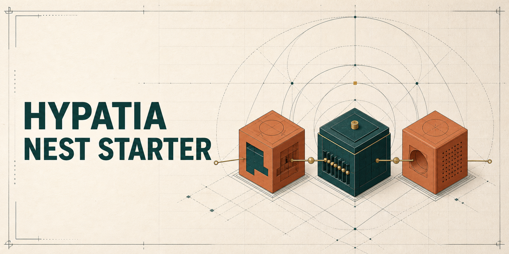

# Hypatia Nest Starter

[](https://github.com/hypatiatecnologia/hypatia-nest-starter)

A Hypatia template for building observable, event-driven NestJS services with **Node.js 22**, **NestJS 11**, PostgreSQL, Redis, and optional RabbitMQ messaging.

> Status: public template candidate. It provides tested defaults and examples, but every derived service still needs its own threat model, capacity planning, dependency updates, and production review.

## What it demonstrates

- REST APIs with validation, Swagger, structured errors, and correlation IDs
- PostgreSQL access through Prisma
- Redis-backed cache and consumer deduplication
- RabbitMQ publisher and consumer modes with dead-letter queues
- Liveness and readiness probes
- Structured Pino logging with sensitive-field redaction
- Graceful shutdown, rate limiting, CI security checks, and a multi-stage container image

## Archetypes

| Archetype | `RABBITMQ_MODE` | HTTP surface | Typical role |
| --- | --- | --- | --- |
| `api` | `publisher` | REST, Swagger, health | API that emits domain events |
| `worker` | `consumer` | Health only | Background event processor |
| `off` | `off` | REST, Swagger, health | API without messaging |

The exchange name `hypatia.events` is part of the example runtime contract. Service and queue names are configuration.

## Quick start

Requirements: Node.js 22, npm, and Docker with Compose.

```bash
git clone https://github.com/hypatiatecnologia/hypatia-nest-starter.git
cd hypatia-nest-starter
nvm use
npm ci
npm test
cp archetypes/api.env.example .env
docker compose up -d --wait postgres redis rabbitmq
npx prisma generate
npx prisma migrate deploy
npm run start:dev
```

Then inspect:

- Swagger: `http://localhost:3000/docs/api`
- Liveness: `http://localhost:3000/health/live`
- Readiness: `http://localhost:3000/health/ready`
- Compatibility health endpoint: `http://localhost:3000/health`
- RabbitMQ management: `http://localhost:15672`

The local setup command performs the same dependency and migration flow:

```bash
npm run setup:local
```

## Create a derived service

Run the scaffold from a clone of this repository:

```bash
npm run create-service -- example-api api
npm run create-service -- example-worker worker
```

The command creates a sibling directory, selects the requested archetype, replaces template identifiers, generates a local development API key when OpenSSL is available, and initializes a new Git repository. It never creates a remote or pushes code.

## Example topology

```text
client -> gateway -> api -> hypatia.events -> worker
                         \-> PostgreSQL
                         \-> Redis
```

Synchronous calls use HTTP; asynchronous integration uses the canonical `HypatiaEvent` envelope. A failed consumer delivery is rejected without requeue and routed to a dead-letter queue.

## Runtime contracts

- `x-correlation-id` is accepted or generated and propagated to responses, logs, and events.
- Events contain `eventId`, `type`, `occurredAt`, optional `correlationId`, and `payload`.
- Readiness reflects the dependencies required by the selected runtime mode.
- Example JWT and API-key values are for local development only.
- This repository is a GitHub template, not an npm package (`"private": true`).

## Quality checks

```bash
npm run lint:ci
npm run type-check
npm test -- --runInBand
npm run test:scripts
npm run build
npm audit --audit-level=high
```

CI keeps quality, dependency/secret scanning, and container scanning as separate gates.

## Documentation

- [First steps](docs/onboarding/PRIMEIROS-PASSOS.md)
- [Onboarding guide](docs/onboarding/ONBOARDING.md)
- [Glossary](docs/onboarding/GLOSSARIO.md)
- [Architecture map](docs/onboarding/MAPA-MENTAL.md)
- [Troubleshooting](docs/onboarding/TROUBLESHOOTING.md)
- [Architecture decisions](docs/adr/)

## Scope and support

The starter is a maintained reference snapshot. Derived services do not receive updates automatically; review the changelog and deliberately merge or cherry-pick relevant changes. Public issues may document reproducible defects, but no response-time commitment is implied.

## License

[MIT](LICENSE) © Hypatia Tecnologia.
