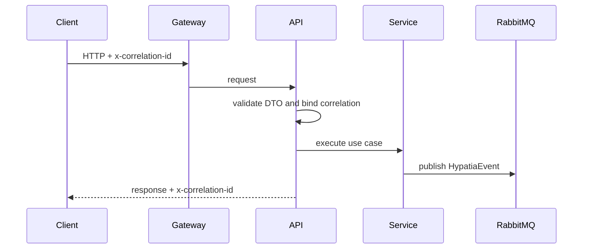
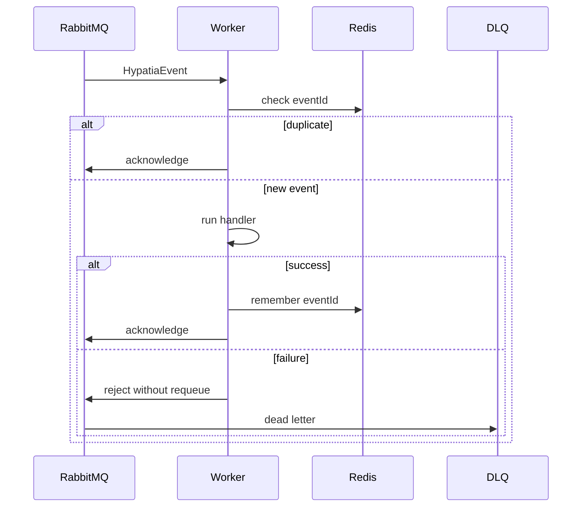

# Mapa mental — Hypatia Nest Starter

## Fluxo HTTP e publicação



## Fluxo do worker



## Camadas

```text
HTTP boundary
  -> controllers and event consumers
    -> application services
      -> Prisma, Redis, RabbitMQ and outbound HTTP adapters
```

## Topologia genérica

```text
gateway -> api --publish--> hypatia.events --route--> worker
             |                                  |
             +--> PostgreSQL / Redis             +--> DLQ on failure
```

## Pontos de entrada no código

| Fluxo | Arquivo |
| --- | --- |
| Bootstrap | `src/main.ts` |
| Descoberta de módulos | `src/common/module-discovery/module-discovery.ts` |
| Correlation ID | `src/common/correlation/` |
| Publicação e consumo | `src/rabbitmq/rabbitmq.service.ts` |
| Consumer de exemplo | `src/modules/example/example-event.consumer.ts` |
| Health | `src/health.controller.ts` |
| Erros | `src/common/filters/all-exceptions.filter.ts` |
| HTTP de saída | `src/http/http-client.service.ts` |
