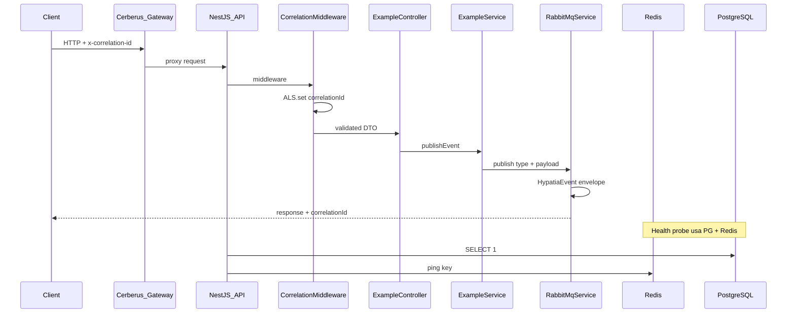
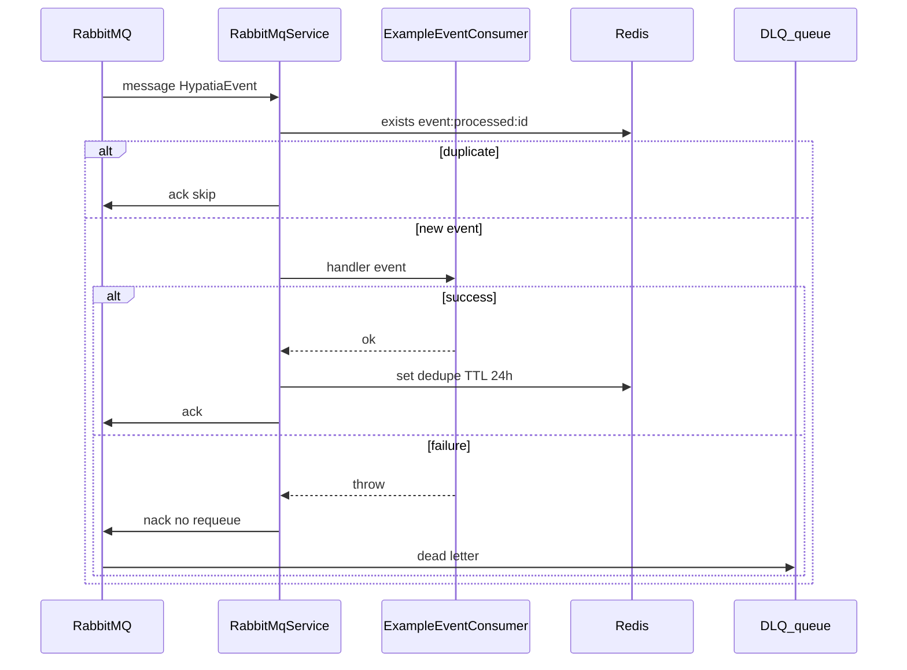

# Mapa mental — fluxos do Hypatia Nest Starter

Visualização de como os componentes se conectam no archetype **api** (publisher).

## Fluxo HTTP → evento



## Fluxo worker (consumer)



## Camadas do projeto

```text
┌─────────────────────────────────────────────────────────┐
│  Borda HTTP (main.ts)                                    │
│  correlationMiddleware · ValidationPipe · helmet · Pino  │
└──────────────────────────┬──────────────────────────────┘
                           │
┌──────────────────────────▼──────────────────────────────┐
│  Adaptadores (controllers / consumers)                     │
│  src/modules/<feature>/*.controller.ts                   │
│  src/modules/<feature>/*-event.consumer.ts               │
└──────────────────────────┬──────────────────────────────┘
                           │
┌──────────────────────────▼──────────────────────────────┐
│  Aplicação (services)                                    │
│  src/modules/<feature>/*.service.ts                      │
└──────────────────────────┬──────────────────────────────┘
                           │
┌──────────────────────────▼──────────────────────────────┐
│  Infra compartilhada                                     │
│  Prisma · Redis · RabbitMQ · HttpClient                  │
└─────────────────────────────────────────────────────────┘
```

## Topologia RabbitMQ

```text
                    publish (routing key = event.type)
  [API Service] ──────────────────────────► hypatia.events (topic)
                                                    │
                                                    │ bind #
                                                    ▼
                                            hypatia-service.events
                                                    │
                              handler fail nack ────┼──► hypatia.events.dlx
                                                    │              │
                                                    │              ▼
                                                    │    hypatia-service.events.dlq
                                                    ▼
                                            [Worker Service]
```

## Onde aprender cada peça

| Fluxo | Arquivo principal |
| --- | --- |
| Bootstrap | `src/main.ts` |
| Auto-discovery de módulos | `src/common/module-discovery/module-discovery.ts` |
| Correlation | `src/common/correlation/` |
| Publish | `src/rabbitmq/rabbitmq.service.ts` |
| Consume | `src/modules/example/example-event.consumer.ts` |
| Health | `src/health.controller.ts` |
| Erros | `src/common/filters/all-exceptions.filter.ts` |
| HTTP outbound | `src/http/http-client.service.ts` |
